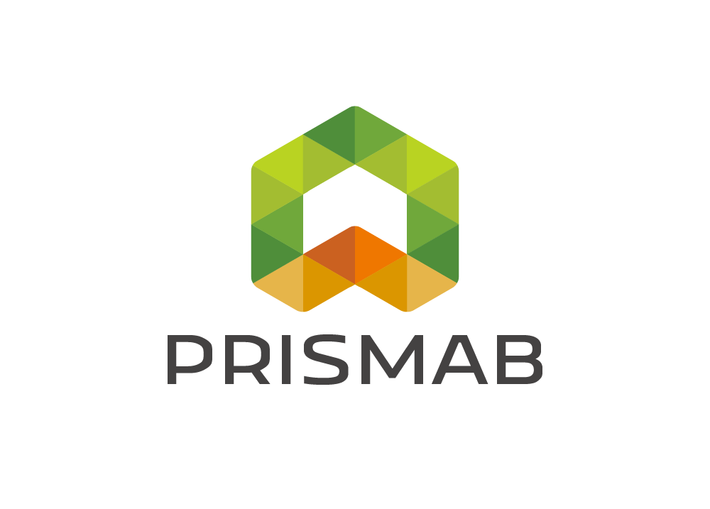

# Universidad Peruana de Ciencias Aplicadas

**Facultad de Ingeniería**

**Carrera de Ingeniería de Software**

**Ciclo:** 2026-01 | **Sección:**

**Código del curso:** 1ASI0729

**Nombre del curso:** Desarrollo de Aplicaciones Open Source

**NRC:** 11881

**Profesor:** Ing. Bautista Ubillús Efraín Ricardo

## Informe de Trabajo Final

**Startup:** GreenSpot

**Producto:** KAMPO

### Relación de Integrantes

U202517474 | Hurtado Balcazar, Rommel Daniel.
U202018427 | Ramos Fuentes Rivera, Adriana Nicole.
U20251I477 | Tuesta Girón, Kiara Lucia.
U202311469 | Arroyo Gonzales, Emily Juliette.
U202314898 | Acuache Lucas, Mathias Joaquin.

**Marzo, 2026**

### Registro de Versiones del Informe

---

|Versión| Fecha        |Autor|Descripción de Modificación|
|---|--------------|---|---|
|1.0.0| 12 Abr. 2026 |Rommel H.| Creación del documento Markdown|

### Project Report Collaboration Insights

---

# Tabla de Contenidos

- [Student Outcome](#student-outcome)

## [Capítulo I: Introducción](#capítulo-i-introducción)
- [1.1. Startup Profile](#11-startup-profile)
    - [1.1.1. Descripción de la Startup](#111-descripción-de-la-startup)
    - [1.1.2. Perfiles de integrantes del equipo](#112-perfiles-de-integrantes-del-equipo)
- [1.2. Solution Profile](#12-solution-profile)
    - [1.2.1. Antecedentes y problemática](#121-antecedentes-y-problemática)
    - [1.2.2. Lean UX Process](#122-lean-ux-process)
        - [1.2.2.1. Lean UX Problem Statements](#1221-lean-ux-problem-statements)
        - [1.2.2.2. Lean UX Assumptions](#1222-lean-ux-assumptions)
        - [1.2.2.3. Lean UX Hypothesis Statements](#1223-lean-ux-hypothesis-statements)
        - [1.2.2.4. Lean UX Canvas](#1224-lean-ux-canvas)
- [1.3. Segmentos objetivo](#13-segmentos-objetivo)

## [Capítulo II: Requirements Elicitation & Analysis](#capítulo-ii-requirements-elicitation--analysis)
- [2.1. Competidores](#21-competidores)
    - [2.1.1. Análisis competitivo](#211-análisis-competitivo)
    - [2.1.2. Estrategias y tácticas frente a competidores](#212-estrategias-y-tácticas-frente-a-competidores)
- [2.2. Entrevistas](#22-entrevistas)
    - [2.2.1. Diseño de entrevistas](#221-diseño-de-entrevistas)
    - [2.2.2. Registro de entrevistas](#222-registro-de-entrevistas)
    - [2.2.3. Análisis de entrevistas](#223-análisis-de-entrevistas)
- [2.3. Needfinding](#23-needfinding)
    - [2.3.1. User Personas](#231-user-personas)
    - [2.3.2. User Task Matrix](#232-user-task-matrix)
    - [2.3.3. User Journey Mapping](#233-user-journey-mapping)
    - [2.3.4. Empathy Mapping](#234-empathy-mapping)
- [2.4. Big Picture Event Storming](#24-big-picture-event-storming)
- [2.5. Ubiquitous Language](#25-ubiquitous-language)

## [Capítulo III: Requirements Specification](#capítulo-iii-requirements-specification)
- [3.1. User Stories](#31-user-stories)
- [3.2. Impact Mapping](#32-impact-mapping)
- [3.3. Product Backlog](#33-product-backlog)

## [Capítulo IV: Product Design](#capítulo-iv-product-design)
- [4.1. Style Guidelines](#41-style-guidelines)
    - [4.1.1. General Style Guidelines](#411-general-style-guidelines)
    - [4.1.2. Web Style Guidelines](#412-web-style-guidelines)
- [4.2. Information Architecture](#42-information-architecture)
    - [4.2.1. Organization Systems](#421-organization-systems)
    - [4.2.2. Labeling Systems](#422-labeling-systems)
    - [4.2.3. SEO Tags and Meta Tags](#423-seo-tags-and-meta-tags)
    - [4.2.4. Searching Systems](#424-searching-systems)
    - [4.2.5. Navigation Systems](#425-navigation-systems)
- [4.3. Landing Page UI Design](#43-landing-page-ui-design)
    - [4.3.1. Landing Page Wireframe](#431-landing-page-wireframe)
    - [4.3.2. Landing Page Mock-up](#432-landing-page-mock-up)
- [4.4. Web Applications UX/UI Design](#44-web-applications-uxui-design)
    - [4.4.1. Web Applications Wireframes](#441-web-applications-wireframes)
    - [4.4.2. Web Applications Wireflow Diagrams](#442-web-applications-wireflow-diagrams)
    - [4.4.3. Web Applications Mock-ups](#443-web-applications-mock-ups)
    - [4.4.4. Web Applications User Flow Diagrams](#444-web-applications-user-flow-diagrams)
- [4.5. Web Applications Prototyping](#45-web-applications-prototyping)
- [4.6. Domain-Driven Software Architecture](#46-domain-driven-software-architecture)
    - [4.6.1. Design-Level Event Storming](#461-design-level-event-storming)
    - [4.6.2. Software Architecture Context Diagram](#462-software-architecture-context-diagram)
    - [4.6.3. Software Architecture Container Diagrams](#463-software-architecture-container-diagrams)
    - [4.6.4. Software Architecture Components Diagrams](#464-software-architecture-components-diagrams)
- [4.7. Software Object-Oriented Design](#47-software-object-oriented-design)
    - [4.7.1. Class Diagrams](#471-class-diagrams)
- [4.8. Database Design](#48-database-design)
    - [4.8.1. Database Diagrams](#481-database-diagrams)

## [Capítulo V: Product Implementation, Validation & Deployment](#capítulo-v-product-implementation-validation--deployment)
- [5.1. Software Configuration Management](#51-software-configuration-management)
    - [5.1.1. Software Development Environment Configuration](#511-software-development-environment-configuration)
    - [5.1.2. Source Code Management](#512-source-code-management)
    - [5.1.3. Source Code Style Guide & Conventions](#513-source-code-style-guide--conventions)
    - [5.1.4. Software Deployment Configuration](#514-software-deployment-configuration)
- [5.2. Landing Page, Services & Applications Implementation](#52-landing-page-services--applications-implementation)
    - [5.2.X. Sprint n](#52x-sprint-n)
        - [5.2.X.1. Sprint Planning n](#52x1-sprint-planning-n)
        - [5.2.X.2. Aspect Leaders and Collaborators](#52x2-aspect-leaders-and-collaborators)
        - [5.2.X.3. Sprint Backlog n](#52x3-sprint-backlog-n)
        - [5.2.X.4. Development Evidence for Sprint Review](#52x4-development-evidence-for-sprint-review)
        - [5.2.X.5. Execution Evidence for Sprint Review](#52x5-execution-evidence-for-sprint-review)
        - [5.2.X.6. Services Documentation Evidence for Sprint Review](#52x6-services-documentation-evidence-for-sprint-review)
        - [5.2.X.7. Software Deployment Evidence for Sprint Review](#52x7-software-deployment-evidence-for-sprint-review)
        - [5.2.X.8. Team Collaboration Insights during Sprint](#52x8-team-collaboration-insights-during-sprint)
- [5.3. Validation Interviews](#53-validation-interviews)
    - [5.3.1. Diseño de Entrevistas](#531-diseño-de-entrevistas)
    - [5.3.2. Registro de Entrevistas](#532-registro-de-entrevistas)
    - [5.3.3. Evaluaciones según heurísticas](#533-evaluaciones-según-heurísticas)
- [5.4. Video About-the-Product](#54-video-about-the-product)

## [Conclusiones](#conclusiones)
- [Conclusiones y recomendaciones](#conclusiones-y-recomendaciones)
- [Video About-the-Team](#video-about-the-team)

## [Bibliografía](#bibliografía)

## [Anexos](#anexos)

---
### Student Outcome
---

**Criterio:** Capacidad de comunicarse efectivamente con un rango de audiencias.
En el siguiente cuadro se describe las acciones realizadas y enunciados de conclusiones por parte del grupo, que permiten sustentar el haber alcanzado el logro del ABET – EAC - Student Outcome 3.

|Criterio Específico|Acciones Realizadas|Conclusiones|
|---|---|---|
|**Comunica oralmente con efectividad a diferentes rangos de audiencia.**|---|---|
|**Comunica por escrito con efectividad a diferentes rangos de audiencia**|---|---|

---

### Capítulo I: Introducción
#### 1.1. Startup Profile
##### 1.1.1. Descripción de la Startup

**GreenSopt** es una startup de tecnología agrícola fundado por estudiantes universitarios peruanos, con la misión de digitalizar la gestión del campo para pequeños y medianos agricultores del Perú. Nuestro producto principal, **KAMPO**, es una plataforma SaaS que combina el monitoreo de cultivos y control de rentabilidad en una sola herramienta accesible y diseñada para el contexto local.
La mayoría de agricultores peruanos aún gestionan sus cultivos y finanzas de forma manual, sin acceso a herramientas digitales especializadas. KAMPO busca cerrar esa brecha ofreciendo tres planes adaptados a distintos niveles de adopción tecnología:
**Semilla** ( gestión básica ), **Cosecha** ( integración IoT y reportes ) y **Hacienda** ( Inteligencia Artificial y gestión multi-parcela ).

##### 1.1.2. Perfiles de integrantes del equipo

<!-- Remplaza con tu foto:  -->

#### 1.2. Solution Profile
##### 1.2.1. Antecedentes y problemática

###### Antecedentes
La agricultura peruana representa el 4.6% del PBI nacional y es uno de los pilares históricos de la economía del país (BCRP, 2024). En la última década, las exportaciones agrícolas crecieron de US$4,400 millones en 2013 a US$10,500 millones en 2023, evidenciando el enorme potencial del sector (MIDAGRI, 2024). Sin embargo, este crecimiento ha sido desigual: mientras las grandes empresas agroexportadoras adoptan tecnología de precisión, sensores y análisis de datos, el agricultor pequeño y mediano sigue gestionando su campo y sus finanzas de forma manual, con cuadernos o herramientas genéricas como hojas de cálculo.

Según el MIDAGRI, el 85% de los agricultores peruanos trabaja en parcelas de menos de 10 hectáreas, predominando unidades productivas de entre 3 y 10 ha. Este segmento mayoritario enfrenta una profunda brecha tecnológica: según la Encuesta Nacional Agropecuaria del INEI (2022), solo el 7% de los pequeños y medianos productores utiliza sistemas de riego tecnificado, frente al 53% entre los grandes productores. A nivel nacional, apenas el 20% de la superficie agrícola cuenta con riego tecnificado (Business Empresarial, 2024).

La transformación digital del agro es reconocida como una necesidad urgente. La CEPAL señala que para que la agricultura digital sea una realidad en América Latina se requiere conectividad, acceso a tecnología a costos accesibles y alfabetización digital. Aun así, el acceso, la capacitación y la conectividad digital siguen siendo retos clave para la adopción masiva por parte de pequeños y medianos productores (ADAMA, 2025).

---

###### Problemática

**¿Quién?** Pequeños y medianos agricultores peruanos, que representan el 85% del total de productores del país, con parcelas de entre 3 y 50 hectáreas. Se ubican en las tres regiones naturales del Perú: costa, sierra y selva, y gestionan cultivos de consumo interno y exportación. En la sierra, el 63.6% son pequeños productores que trabajan con tierras de menor extensión (EY, 2025).

**¿Qué?** Los agricultores no cuentan con herramientas digitales accesibles para gestionar dos aspectos fundamentales de su actividad: el monitoreo de sus cultivos (condiciones del suelo, riego, etapas del ciclo productivo) y el control de su rentabilidad (costos, ingresos, análisis por cultivo). Esta doble carencia les impide tomar decisiones informadas tanto sobre el campo como sobre su negocio, generando pérdidas evitables por mala gestión del riego, uso ineficiente de insumos y desconocimiento real de si su actividad es o no rentable.

**¿Dónde?** En todo el territorio peruano, con especial impacto en zonas rurales con limitado acceso a servicios de asesoría técnica y financiera. La costa, responsable del 68% de la producción agrícola nacional, dispone de menos del 2% del agua total del país (BCRP, 2024), lo que hace crítica la gestión inteligente del riego. La sierra, con mayor concentración de pequeños agricultores, enfrenta además barreras de conectividad y baja adopción tecnológica.

**¿Cuándo?** El problema es estructural y viene agravándose en los últimos años por el impacto del cambio climático (lluvias erráticas, retroceso glaciar), el alza de costos de insumos agrícolas y la creciente exigencia de los mercados. La urgencia se intensifica en cada campaña agrícola, cuando el agricultor debe tomar decisiones críticas de inversión sin datos confiables.

**¿Por qué?** Las soluciones tecnológicas existentes en el mercado están diseñadas para grandes empresas agroindustriales, con precios y complejidad fuera del alcance del agricultor promedio. No existe una plataforma integral, accesible y en español que combine monitoreo de cultivos con gestión de rentabilidad, adaptada a la realidad del pequeño y mediano productor peruano. La brecha tecnológica entre el gran agroexportador y el agricultor familiar sigue siendo una barrera estructural no resuelta.

**¿Cómo?** La problemática se manifiesta de forma concreta en tres patrones recurrentes:
- El agricultor riega por intuición o experiencia, sin datos de humedad del suelo, generando desperdicio hídrico o estrés hídrico en el cultivo. Hasta el 45% del agua se pierde por canales en mal estado o mala gestión (ANA, 2023). 
- El agricultor no lleva un registro ordenado de sus costos e ingresos por campaña, por lo que no puede determinar con precisión si su cultivo fue rentable ni en qué rubros puede optimizar. 
- Al no tener alertas ni seguimiento del ciclo del cultivo, reacciona tarde ante plagas, enfermedades o condiciones climáticas adversas, incrementando pérdidas evitables.

**¿Cuánto?** La brecha en infraestructura agrícola en el Perú es de US$37,000 millones según el Banco Mundial (EY, 2025). El mercado global de agricultura inteligente pasará de US$12,400 millones en 2020 a US$34,100 millones en 2026 (CEPLAN). En Perú, solo el 7% de los pequeños y medianos productores usa tecnología de riego avanzada, lo que representa una oportunidad de mercado masiva aún sin atender con soluciones digitales accesibles y localizadas.

---

El pequeño y mediano agricultor peruano opera con información insuficiente, toma decisiones por experiencia empírica y no dispone de herramientas que le permitan monitorear su cultivo y conocer la rentabilidad real de su negocio. KAMPO surge como respuesta directa a esta doble necesidad: una plataforma SaaS integral, accesible y diseñada para el contexto peruano, que traduce datos en decisiones y convierte el campo en un negocio gestionable.

##### 1.2.2. Lean UX Process
###### 1.2.2.1. Lean UX Problem Statements
En el sector agrícola peruano, el pequeño y mediano productor (que gestiona entre 3 y 50 hectáreas) opera en un entorno de alta incertidumbre y falta de herramientas técnicas. 
A diferencia de las grandes agroexportadoras que utilizan tecnología de precisión, el agricultor tradicional toma decisiones críticas basadas en la intuición o experencias pasasdas.
¿Cómo podríamos facilitar que estos productores accedan a datos técnicos de su campo sin que puedan tener una inversión inalcanzable?

Hemos observado que la gestión del riego es uno de los puntos más críticos. Actualmente, gran parte de los agricultores riega bajo un calendario fijo o por simple observación, 
lo que genera un desperdicio de agua de hasta el 45%. Esto reduce la calidad del producto final e impide que se venda a un precio competitivo. Ante esto, surge la interrogante:
¿Existe una forma de proporcionar indicadores precisos sobre el clima y la calidad del suelo para asegurar una cosecha óptima?

Por otro lado, la administración financiera de las parcelas suele llevarse de forma manual en cuadernos o registros informales. Esto impide que el agricultor conozca con precisión
la rentabilidad por cada campaña, lo cual es vital dado que la agricultura se rige por temporadas. No contabilizar adecuadamente los costos genera un desconocimiento crítico sobre
la inversión en insumos y mano de obra. ¿De qué manera podríamos ayudar a los agricultores a que puedan gestionar sus costos y conocer su rentabilidad real?

Finalmente, factores externos  como el cambio climático y el alza de precios en fertilizantes obligan a los productores a ser más eficientes que nunca. Sin embargo, la información 
técnica sobre el estado de sus cultivos tarda en ser procesada o simplemente no existe, esto impide que el agricultor llegue a tomar decisiones a ciegas y no pueda gestionar de una 
manera rentable su cultivo. ¿De qué manera podríamos ayudar a los agricultores a que puedan gestionar su cosecha de manera rentable?

###### 1.2.2.2. Lean UX Assumptions
#### A. BUSINESS OUTCOMES
Para que nuestro software pueda tener un mejor resultado, hemos realizado diversas suposiciones para validar el uso de la aplicación:

* **Reducción de Abandono:** Mantener una tasa de abandono menor al 10% mensual, asegurando que el agricultor pueda gestionar sus datos con nuestra app luego de probarlo gratuitamente.

* **Crecimiento Orgánico:** Conseguir que cada usuario activo refiera al menos a más agricultores de su misma zona o asociación, reduciendo el costo de adquisición de clientes en regiones rurales, de esta manera la aplicación crecerá de manera exponencial en el rubro de la agricultura.

* **Escalabilidad del Dominio:** Validar que el modelo de "Campaña y Lote" funcione tanto para cultivos de costa como de la sierra, permitiendo tener una expansión por todo el Perú.

* **Reducción de Pérdidas:** Disminuir en un 25% las pérdidas de cultivos reportadas por los usuarios gracias a la anticipación mediante alertas técnicas.

#### B. USERS OUTCOMES
Vamos a asumir diversos supuestos del cliente para que de esta manera tener una validación en la aplicación a realizar.

* **¿Quién es el cliente?**
  Pequeños y medianos agricultores peruanos ubicados en las regiones del Perú, que poseen smartphones pero carecen de herramientas digitales especializadas para el campo.

* **¿Dónde encaja nuestro producto en su vida?**
  Como una herramienta de consulta diaria en la parcela para la toma de decisiones técnicas y como libro digital para operaciones financieras.

* **¿Qué problemas soluciona nuestro producto?**
  Elimina la incertidumbre sobre el riego, previene la pérdida de cultivos por falta de datos técnicos y ambientales y ayuda a la gestión financiera de los usuarios.

* **¿Cuándo y cómo se utiliza nuestro producto?**
  Diariamente para monitorear el estado del suelo y clima, y de manera frecuente para el control de gastos operativos.

* **¿Qué características son importantes?**
  Alertas preventivas de riego/clima, registro simplificado de ingresos y egresos, historial de campañas, etc.

* **¿Cómo deberían verse y comportarse nuestro producto?**
  Con una interfaz amigable, iconos con fácil visibilidad, legibles, que pueda ser de fácil uso para los agricultores y que tengan un rendimiento bueno.
  
###### 1.2.2.3. Lean UX Hypothesis Statements

* **Hipótesis 1:**
**Creemos que** al proporcionar un sistema de alertas de riego basado en sensores de humedad y clima para los pequeños y medianos agricultores, lograremos que reduzcan el
desperdicio de agua en un 20% y mejoren la calidad de su cosecha. **Sabremos que tenemos razón cuando** los registros de riego en la plataforma muestren resultados en comparación a
como antes el usuarios desperdiciaba agua en sus cultivos.

* **Hipótesis 2:**
**Creemos que** al implementar un módulo de registro simplificado de ingresos y egresos por campaña para los productores, lograremos que el agricultor identifique su utilidad neta
en tiempo real y tome mejores decisiones de inversión, además de tener una ayuda interna con la aplicación para dichas decisiones. **Sabremos que tenemos razón cuando** el 60% de
los usuarios activos logren completar el flujo financiero total de su cosecha dentro de la aplicación.

###### 1.2.2.4. Lean UX Canvas

El Lean UX Canvas de KAMPO sintetiza los ocho bloques del proceso: el problema
de negocio central (falta de herramientas digitales accesibles para el agricultor
peruano), los resultados esperados para el negocio y el usuario, los segmentos
objetivo, las ideas de solución, las hipótesis a validar, y el mínimo esfuerzo
necesario para aprender antes de construir. El canvas completo se presenta en
la figura adjunta.

.png)

---

#### 1.3. Segmentos objetivo

KAMPO identifica dos segmentos objetivo con características, necesidades y
niveles de adopción tecnológica distintos.

---

**Segmento 1: Ingenieros agrónomos asesores y supervisores de cultivos**

Profesionales del agro que asesoran o supervisan activamente el estado de
cultivos en uno o varios fundos, ya sea de forma independiente o contratados
por empresas agrícolas. Constituyen un segmento estratégico porque son el
puente natural entre la tecnología y el agricultor: comprenden el lenguaje
técnico del campo, tienen capacidad de evaluar herramientas digitales y, al
mismo tiempo, influyen directamente en las decisiones de los propietarios
o administradores de los fundos que atienden.

Demográficamente, son profesionales de entre 25 y 45 años con formación
técnica o universitaria en agronomía, ciencias agrícolas o afines. Poseen
alta familiaridad con dispositivos digitales y suelen atender entre 3 y 15
fundos de forma simultánea, lo que hace que su principal dolor sea la falta
de una plataforma centralizada para registrar, dar seguimiento y compartir
sus recomendaciones técnicas con cada cliente.

Las funciones que más valoran son el historial de cultivos por parcela,
las alertas automáticas por condición del suelo o clima, y los reportes
exportables para compartir con los propietarios del fundo.

---

**Segmento 2: Agroindustria mediana y grande**

Empresas agroindustriales, cooperativas o sociedades comerciales que
procesan, acopian o comercializan producción agrícola a escala media o
grande, operando con múltiples fundos proveedores de forma simultánea.
Este segmento se caracteriza por tener estructuras de gestión formalizadas,
presencia en varias regiones del país y exigencias crecientes de sus
mercados destino —tanto nacionales como de exportación— en cuanto a
trazabilidad, inocuidad y estándares de producción.

Demográficamente, sus tomadores de decisión son gerentes agrícolas,
jefes de campo o administradores de entre 30 y 55 años, con experiencia
en gestión de operaciones y familiaridad con herramientas empresariales.

El tamaño de sus operaciones varía desde medianas empresas que gestionan
entre 50 y 500 hectáreas propias o de terceros, hasta grandes corporaciones
con miles de hectáreas distribuidas en distintas regiones del país.

Su dolor principal es la falta de visibilidad en tiempo real sobre el
estado del campo de sus proveedores o unidades productivas: no saben con
certeza cuándo se sembrará, cómo está evolucionando el cultivo ni cuándo
y en qué volumen llegará la cosecha.

Las exportaciones agrícolas peruanas alcanzaron los US$10,500 millones en
2023 (MIDAGRI, 2024), y la presión por cumplir estándares de calidad
internacionales hace que la trazabilidad desde el campo sea cada vez más
un requisito competitivo y no solo una ventaja.

## Capítulo II: Requirements Elicitation & Analysis
## 2.1. Competidores
 

  Agrisoft es una empresa peruana centrada en la gestión administrativa y financiera del sector agroindustrial, la cual ofrece un sistema ERP completo que permite controlar costos por hectárea, manejar planillas, gestionar almacenes, llevar trazabilidad de cosechas y facturar electrónicamente integrado con SUNAT. Asimismo, algunas de sus funcionalidades son el registro detallado de insumos, maquinaria y mano de obra, la generación de reportes financieros por cultivo o temporada, y el control de stock y compras. Por último, este sistema está enfocado en grandes agroexportadoras, cooperativas agrícolas de tamaño mediano a grande y empresas del agro peruano que requieren un control contable riguroso.

 

  Agricolum es una plataforma internacional de origen español que combina el cuaderno de campo digital con la gestión operativa y financiera de una explotación agrícola. Además, permite registrar tareas y tratamientos fitosanitarios, controlar costos por cultivo, gestionar mano de obra, generar trazabilidad obligatoria para normativas europeas y exportar informes regulatorios, y sus funcionalidades incluyen la planificación de cosechas, el control de inventario de insumos, el registro de jornales y la generación automática de reportes para certificaciones. Finalmente, esta plataforma está enfocada en empresas de servicios agrícolas, cooperativas y asesores agrónomos que necesitan cumplir con exigencias legales de trazabilidad y cuaderno de campo digital.

 

  Prismab es una solución especializada en el monitoreo técnico del riego, con un fuerte enfoque en la eficiencia hídrica y la reducción del consumo de agua, por esta razón, utiliza sensores inalámbricos que miden humedad del suelo y salinidad, enviando datos en tiempo real a una plataforma digital. También incluye funcionalidades como alertas automáticas por condiciones críticas, reportes históricos de consumo de agua, recomendaciones precisas para optimizar el riego e integración con sistemas de riego automatizado. En resumen, Prismab está enfocada en agricultores que ya utilizan o desean implementar riego tecnificado, especialmente en zonas con estrés hídrico, y en cultivos de alto valor.

##### 2.1.1. Análisis competitivo
El análisis competitivo implica examinar detenidamente a nuestros competidores para identificar sus fortalezas, debilidades, oportunidades y amenazas. Esto nos proporcionará una visión clara de nuestro posicionamiento en el mercado y nos ayudará a desarrollar estrategias efectivas.

<table>
  <tr>
    <th colspan="7" valign="top"><b>Competitive Analysis Landscape</b></th>
  </tr>
  <tr>
    <td colspan="2" rowspan="2">¿Por qué llevar a cabo este análisis?</td>
    <td colspan="5">Escriba en el recuadro la pregunta que busca responder o el objetivo de este análisis.</td>
  </tr>
  <tr>
    <td colspan="5">El análisis competitivo es fundamental para entender el entorno en el que KAMPO opera, identificar las fortalezas y debilidades de los competidores, y descubrir oportunidades y amenazas en el mercado. Este análisis ayuda a posicionar mejor nuestra startup en relación con los competidores y a definir estrategias que maximicen nuestra ventaja competitiva.</td>
  </tr>
  <tr>
    <td colspan="3">Nombre y Logo</td>
    <td colspan="1" valign="top" style="font-weight: bold;">
        KAMPO
         
        

                </img>
        

    <td colspan="1" valign="top" style="font-weight: bold;">
    Agrisoft
    

                </img>
        

    </td>
    <td colspan="1" valign="top" style="font-weight: bold;">
      Agricolum
      

                </img>
            

      </td>
    <td colspan="1" valign="top" style="font-weight: bold;" >
      Prismab
      

                </img>
            

    </td>
  </tr>
  <tr>
    <td colspan="1" rowspan="2">
Perfil
</td>
    <td colspan="2">Overview</td>
    <td colspan="1" valign="top">Plataforma web y móvil enfocada en ingenieros agrónomos y fundos peruanos. Combina control de cultivos, rentabilidad e inventario, con la opción de escalar a servicios IoT.</td>
    <td colspan="1" valign="top">ERP agrícola robusto para agroexportadoras y fundos grandes. Muy orientado a costos, almacenes, planillas y logística.</td>
    <td colspan="1" valign="top">App agrícola enfocada en cuaderno de campo, trazabilidad, GPS y cumplimiento normativo.</td>
    <td colspan="1" valign="top">Solución orientada a trazabilidad agrícola, packing y control operativo de empresas agroexportadoras.</td>
  </tr>
  <tr>
    <td colspan="2">Ventaja competitiva¿Qué valor ofrece a los clientes?</td>
    <td colspan="1" valign="top">Capacidad de traducir la gestión del cultivo en decisiones financieras simples, integrando en una sola plataforma el control operativo, el uso de recursos y la rentabilidad, mediante una experiencia accesible y adaptada a los usuarios.</td>
    <td colspan="1" valign="top">Tiene amplia experiencia, módulos empresariales y fuerte control financiero.</td>
    <td colspan="1" valign="top">Es muy fuerte en trazabilidad y facilidad de uso móvil.</td>
    <td colspan="1" valign="top">Está especializado en trazabilidad y operaciones agroindustriales.</td>
  </tr>
  <tr>
    <td colspan="1" rowspan="2">
Perfil de Marketing
</td>
    <td colspan="2">Mercado objetivo</td>
    <td colspan="1" valign="top">Ingenieros agrónomos y fundos peruanos.</td>
    <td colspan="1" valign="top">Agroexportadoras, fundos medianos y grandes, empresas con procesos complejos.</td>
    <td colspan="1" valign="top">Agricultores, cooperativas y asesores agrícolas.</td>
    <td colspan="1" valign="top">Empresas agrícolas y exportadoras medianas/grandes.</td>
  </tr>
  <tr>
    <td colspan="2">Estrategias de marketing</td>
    <td colspan="1" valign="top">Venta directa, alianzas con ingerieros agrónomos, cooperativas, y fundos.</td>
    <td colspan="1" valign="top">Ventas consultivas, demos empresariales, referencias y soporte especializado.</td>
    <td colspan="1" valign="top">Marketing digital, prueba gratuita y enfoque en cumplimiento normativo.</td>
    <td colspan="1" valign="top">B2B, relaciones comerciales y proyectos a medida.</td>
  </tr>
  <tr>
    <td colspan="1" rowspan="3">
Perfil de Producto
</td>
    <td colspan="2">Productos & Servicios</td>
    <td colspan="1" valign="top">Registro de parcelas y cultivos, gastos, cosechas, stock de insumos, rentabilidad, dashboard y alertas.</td>
    <td colspan="1" valign="top">Costos de producción, almacenes, planillas, maquinaria, logística y tesorería.</td>
    <td colspan="1" valign="top">Cuaderno de campo digital, GPS, trazabilidad, gestión de cultivos y reportes.</td>
    <td colspan="1" valign="top">Trazabilidad, control de procesos, producción y gestión agrícola.</td>
  </tr>
  <tr>
    <td colspan="2">Precios & Costos</td>
    <td colspan="1" valign="top">La primera membresía basica cuesta S/.20 mensual, la membresia intermedia cuesta S/.45 mensual y la membresia premium cuesta S/.95 mensual.</td>
    <td colspan="1" valign="top">texto</td>
    <td colspan="1" valign="top">La primera membresía es gratuita, la segunda cuesta 168€ al año y la tercera, 336€ al año</td>
    <td colspan="1" valign="top">No tiene membresías. Vende productos IoT (sensores, transmisores, etc.)</td>
  </tr>
  <tr>
    <td colspan="2">Canales de distribución (Web y/o Móvil)</td>
    <td colspan="1" valign="top">Web y móvil.</td>
    <td colspan="1" valign="top">Web.</td>
    <td colspan="1" valign="top">Web y móvil.</td>
    <td colspan="1" valign="top">Web.</td>
  </tr>
  <tr>
    <td colspan="1" rowspan="5">
Análisis SWOT
</td>
    <td colspan="6">Realice esto para su startup y sus competidores. Sus fortalezas deberían apoyar sus oportunidades y contribuir a lo que ustedes definen como su posible ventaja competitiva.</td>
  </tr>
  <tr>
    <td colspan="2">Fortalezas</td>
    <td colspan="1" valign="top">Capacidad de integrar la gestión del cultivo con el análisis de rentabilidad.</td>
    <td colspan="1" valign="top">Muy completo, experiencia de mercado y soporte sólido.</td>
    <td colspan="1" valign="top">Interfaz sencilla, gran adopción y fuerte trazabilidad.</td>
    <td colspan="1" valign="top">Conocimiento del sector agroindustrial y trazabilidad.</td>
  </tr>
  <tr>
    <td colspan="2">Debilidades</td>
    <td colspan="1" valign="top">No cuenta con funcionalidades avanzadas o una marca posicionada.</td>
    <td colspan="1" valign="top">Complejo, caro y poco atractivo para fundos.</td>
    <td colspan="1" valign="top">Menor enfoque financiero y de rentabilidad.</td>
    <td colspan="1" valign="top">Menos orientado a fundos y menor simplicidad.</td>
  </tr>
  <tr>
    <td colspan="2">Oportunidades</td>
    <td colspan="1" valign="top">Gran cantidad de ingenieros agrónomos y fundos peruanos que todavía gestionan sus actividades en papel o Excel.</td>
    <td colspan="1" valign="top">Expandirse hacia agricultura de precisión e IoT.</td>
    <td colspan="1" valign="top">Agregar más analítica financiera.</td>
    <td colspan="1" valign="top">Aprovechar la digitalización del sector exportador.</td>
  </tr>
  <tr>
    <td colspan="2">Amenazas</td>
    <td colspan="1" valign="top">Apps o ERPs existentes puedan replicar sus funcionalidades básicas o lanzar versiones simplificadas.</td>
    <td colspan="1" valign="top">Plataformas más simples, económicas y rápidas de implementar.</td>
    <td colspan="1" valign="top">Pierde relevancia frente a soluciones que implementan automatización, analítica y recomendaciones inteligentes basadas en datos.</td>
    <td colspan="1" valign="top">Depende principalmente de empresas agroindustriales grandes y limita su escalabilidad hacia segmentos más amplios.</td>
  </tr>
</table>

##### 2.1.2. Estrategias y tácticas frente a competidores

#### Estrategias:

- Posicionar a KAMPO como una alternativa práctica y económica, diseñada específicamente para agricultores que no cuentan con las herramientas digitales necesarias.

- Permitir que el usuario empiece con funciones básicas y, a medida que gana confianza, pueda acceder a herramientas más avanzadas sin complicaciones.

- Reducir la barrera de adopción tecnológica mediante una experiencia simple y clara, adaptada al contexto rural y al nivel digital del usuario.

- Construir una propuesta de valor basada en el uso de datos simples y útiles, que permitan al agricultor tomar decisiones rápidas sin necesidad de conocimientos técnicos avanzados.

- Diferenciarse al integrar en una sola plataforma el manejo del cultivo y el control de la rentabilidad, brindando una visión completa del negocio agrícola.

## 2.2. Entrevistas
##### 2.2.1. Diseño de entrevistas
##### 2.2.2. Registro de entrevistas
##### 2.2.3. Análisis de entrevistas
## 2.3. Needfinding
##### 2.3.1. User Personas
##### 2.3.2. User Task Matrix
##### 2.3.3. User Journey Mapping
##### 2.3.4. Empathy Mapping
## 2.4. Big Picture Event Storming
## 2.5. Ubiquitous Language

---

## Capítulo III: Requirements Specification
## 3.1. User Stories
## 3.2. Impact Mapping
## 3.3. Product Backlog

---

## Capítulo IV: Product Design
## 4.1. Style Guidelines](#41-style-guidelines)
##### 4.1.1. General Style Guidelines
##### 4.1.2. Web Style Guidelines
## 4.2. Information Architecture
##### 4.2.1. Organization Systems
##### 4.2.2. Labeling Systems
##### 4.2.3. SEO Tags and Meta Tags
##### 4.2.4. Searching Systems
##### 4.2.5. Navigation Systems
## 4.3. Landing Page UI Design
##### 4.3.1. Landing Page Wireframe
##### 4.3.2. Landing Page Mock-up
## 4.4. Web Applications UX/UI Design
##### 4.4.1. Web Applications Wireframes
##### 4.4.2. Web Applications Wireflow Diagrams
##### 4.4.3. Web Applications Mock-ups
##### 4.4.4. Web Applications User Flow Diagrams
## 4.5. Web Applications Prototyping
## 4.6. Domain-Driven Software Architecture
##### 4.6.1. Design-Level Event Storming
##### 4.6.2. Software Architecture Context Diagram
##### 4.6.3. Software Architecture Container Diagrams
##### 4.6.4. Software Architecture Components Diagrams
## 4.7. Software Object-Oriented Design
##### 4.7.1. Class Diagrams
## 4.8. Database Design
##### 4.8.1. Database Diagrams

---

## Capítulo V: Product Implementation, Validation & Deployment
## 5.1. Software Configuration Management
##### 5.1.1. Software Development Environment Configuration
##### 5.1.2. Source Code Management
##### 5.1.3. Source Code Style Guide & Conventions
##### 5.1.4. Software Deployment Configuration
## 5.2. Landing Page, Services & Applications Implementation
##### 5.2.X. Sprint n
###### 5.2.X.1. Sprint Planning n
###### 5.2.X.2. Aspect Leaders and Collaborators
###### 5.2.X.3. Sprint Backlog n
###### 5.2.X.4. Development Evidence for Sprint Review
###### 5.2.X.5. Execution Evidence for Sprint Review
###### 5.2.X.6. Services Documentation Evidence for Sprint Review
###### 5.2.X.7. Software Deployment Evidence for Sprint Review
###### 5.2.X.8. Team Collaboration Insights during Sprint
## 5.3. Validation Interviews
##### 5.3.1. Diseño de Entrevistas
##### 5.3.2. Registro de Entrevistas
##### 5.3.3. Evaluaciones según heurísticas
## 5.4. Video About-the-Product

## Conclusiones
#### Conclusiones y recomendaciones
#### Video About-the-Team

## Bibliografía

## Anexos

